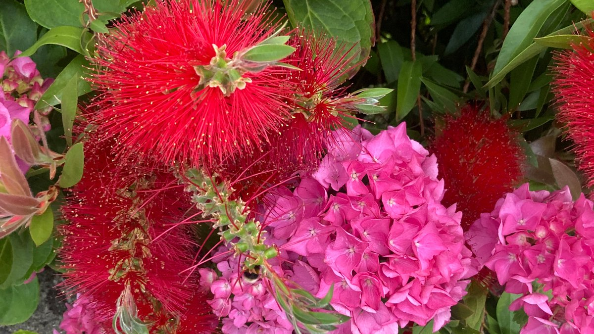

# agents-chat
Multi-user streaming AI chats built using RedwoodSDK, Cloudflare Agents, and RSCs.

- [RSC Chat](/chat-rsc) - syncs via RedwoodSDK realtime websockets
- [Agent Chat](/chat-agent) - syncs via Cloudflare Agents websockets
- [Agent SDK Chat](/chat-agent-sdk) - uses AIChatAgent with the useAgentChat hook
- [TinyBase Chat](/chat-tinybase) - syncs via TinyBase websockets
- [Agent Agent Chat](/chat-agent-agent) - More advanced Cloudflare agent with subagents and MCP tool calling (sse only, no auth). Syncs via agent websocket.
- [Time](/time) - my first RedwoodSDK app, and my first exploration of RSCs.

---
See GitHub [jldec/agents-chat](https://github.com/jldec/agents-chat), or the blog post on [jldec.me](https://jldec.me/blog/multi-user-ai-chat-with-redwoodsdk-rsc-and-cloudflare-agents) for more details.